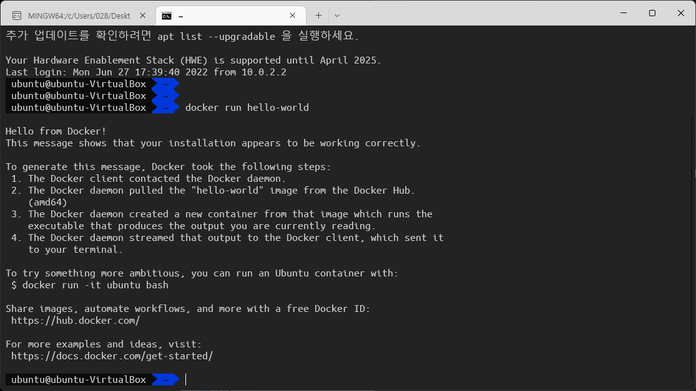

# 1주차 - Day 1 교육내용
## 주요 내용
1. `Github` 또는 `Notion` 을 사용해서 교육내용을 정리하는 습관을 기르자. 되도록 `Github` 권장. ~~그래서 노력중~~
2. 우리가 지금까지 해온 ML(Machine Learning)은 `Research ML` 이다. 실제 서비스에서는 `Product ML` 을 해야 한다.
3. 개발환경이 모두 다르다. 다른 개발환경을 하나로 통일하기 위해 `Docker` 를 사용한다.
4. `Docker` 를 사용하는 서비스의 개수가 늘어날 경우, 관리를 위해 `쿠버네티스` 를 사용한다.
5. `VirtualBox` 를 사용하여 `Ubuntu 가상환경`을 설치하고, Ubuntu 환경에 `Docker` 설치
6. `CLI(Command-Line Interface)` 환경과 친해지기

## 간단 평가
오늘 수업은 DevOps / MLOps 의 기본 개념과 차이점에 대한 설명과 Docker 사용 이유에 대해 수업을 들었다.  
우분투 가상환경 및 Docker 설치에 수업시간의 대부분을 사용한 것 같다.

---

## Ubuntu 설치
### 우분투 이미지(ISO) 파일 받기
우분투 다운로드 URL : https://releases.ubuntu.com/  

다운로드 페이지 접속 후 LTS(Long-Term Support, 장기 지원) 버전으로 받기  
통상적으로, 우분투는 xx.04 버전이 LTS 버전이다.


## VirtualBox 설치
VirtualBox 다운로드 URL : https://www.virtualbox.org/wiki/Downloads  

가상머신에 리눅스를 설치하기 위해 사용하는 가상머신 프로그램이다.  
현재 작업하는 PC 내부에 또 다른 OS를 설치하여 사용할 수 있다.  

위에서 받은 ISO 파일을 이용하여 가상머신 환경 생성 및 설치를 진행한다.

> 사실 윈도우는 WSL(Windows Subsystem for Linux) 기능을 지원하여 쉽게 사용할 수 있지만, 교육과정에서는 편의를 위해 가상머신을 사용한 것 같다.

## Docker 설치
Ubuntu 패키지 매니저 `apt-get`  
관리자(`Su`peruser) 권한으로 해라(`do`)! : `sudo`  

Ubuntu 패키지를 최신 버전으로 유지하기 위해 아래의 명령어를 필수로 사용  
``` shell
$ sudo apt-get update
$ sudo apt-get upgrade
```
여기서 달러(`$`) 표시는 `사용자` 를 의미한다고 배웠다.  

제공해주신 Notion 페이지가 존재했지만, GPG 설정 중 오류가 발생하여...  
나는 Ubuntu 환경에 Docker 를 아래와 같은 방법으로 설치했다.

``` shell
# 최신버전 확인 및 필수 패키지 설치
$ sudo apt-get update
$ sudo apt-get install \
   ca-certificates \
   curl \
   gnupg \
   lsb-release
   
# GPG 관련 설명은 생략되었지만, GPG 키 설정을 위한 과정
$ curl -fsSL https://download.docker.com/linux/ubuntu/gpg | sudo apt-key add -
# ARM 아키텍처 CPU와 x86 아키텍처 CPU의 과정이 틀리다고 하셨다.
# 실습 랩톱은 x86(Intel) 기반이므로, 아래와 같이 진행
$ sudo add-apt-repository "deb [arch=amd64] https://download.docker.com/linux/ubuntu $(lsb_release -cs) stable"
$ apt-get update
$ sudo apt-get install docker-ce docker-ce-cli containerd.io
```
설치를 마치고, 정상 실행 확인 및 사용자에게 docker 명령어의 권한 추가 후 리부팅
``` shell
# Docker 테스트
$ sudo docker run hello-world

# docker 명령 권한 부여
$ sudo usermod -a -G docker $USER
$ sudo service docker restart
# 재부팅??(나는 재부팅을 하지 않아도 작동했었다.)
$ reboot
# 이후로는 'docker' 명령에 'sudo' 명령을 줄 필요가 없음
```

나는 기존 리눅스를 사용하는 환경과 비슷하게 구성하기 위해 `bash -> zsh 변경` 및 `oh-my-zsh 설치`까지 진행했다.  
추가로, `VirtualBox 포트포워딩`을 통해 `Windows Termial` ssh 연결을 통해 사용할 수 있도록 환경 구성을 마쳤다.  

수업 중 `VirtualBox - Windows 간 클립보드가 공유되지 않는 문제`가 발생했는데, 위 환경처럼 구성하면 Windows 의 클립보드를 바로 사용할 수 있다는 장점도 존재했다. (개인적으로 CLI 환경이라면 선호하는 방식)

