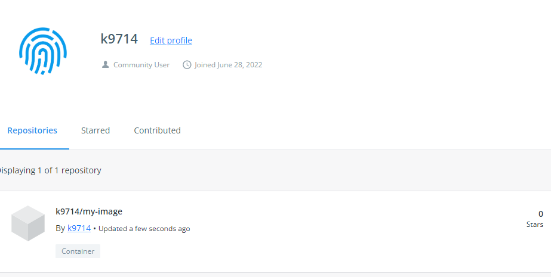
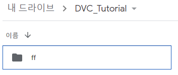
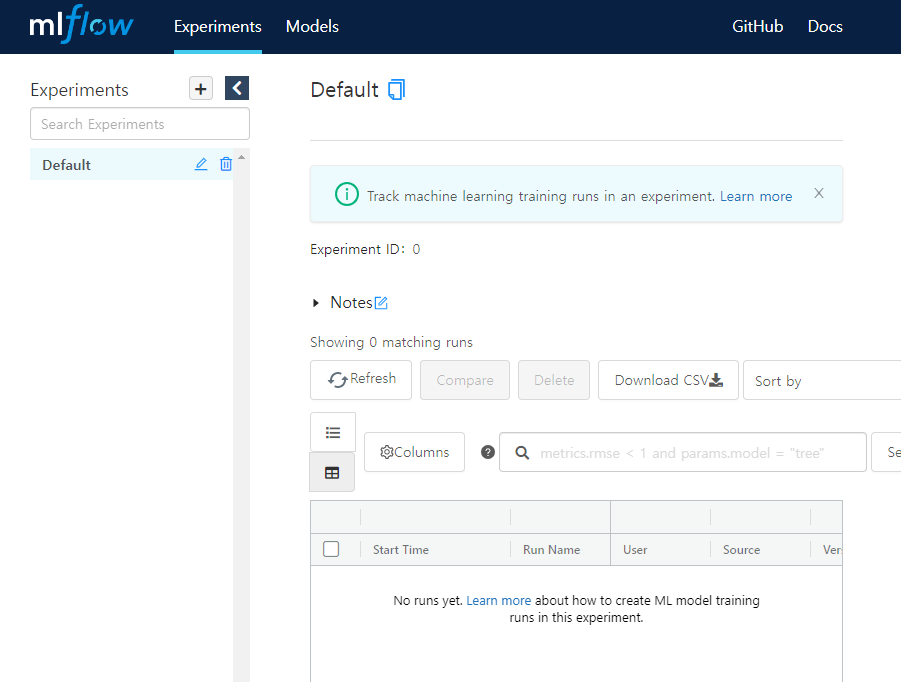
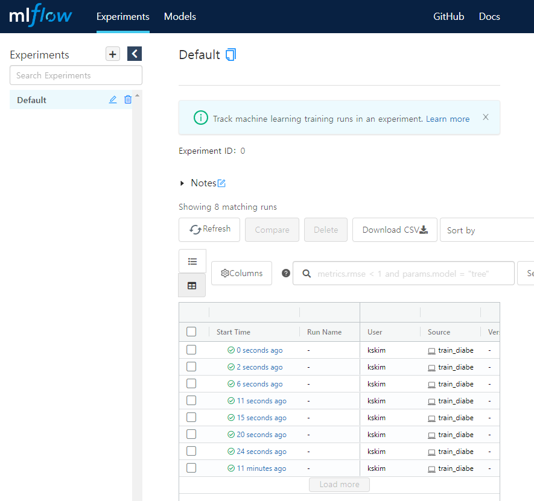
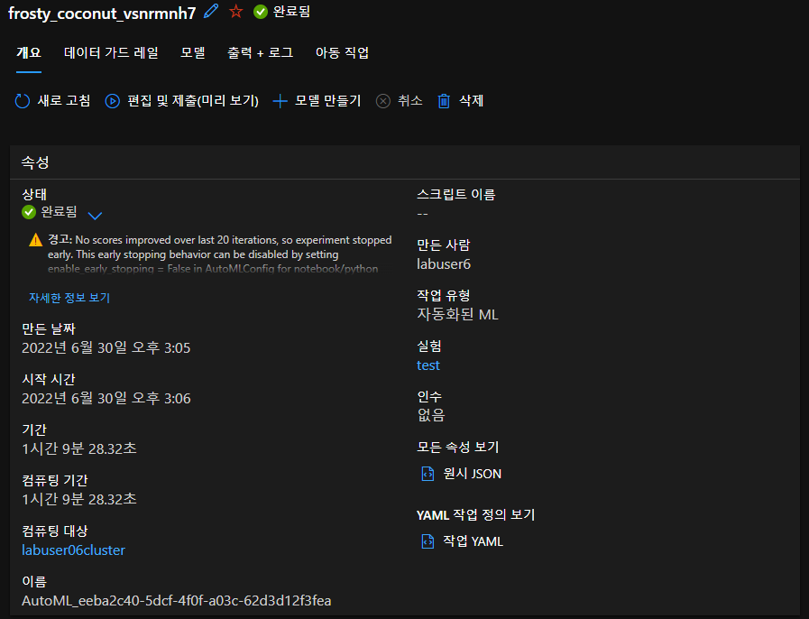
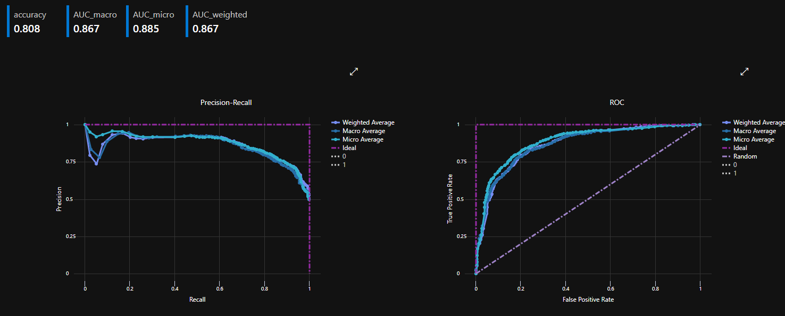

# 1주차 목록
* [Day1 교육내용](#day-1-교육내용) 
* [Day2 교육내용](#day-2-교육내용)
* [Day3 교육내용](#day-3-교육내용)
* [Day4 교육내용](#day-4-교육내용)

---


# Day 1 교육내용

## 주요 내용
1. `Github` 또는 `Notion` 을 사용해서 교육내용을 정리하는 습관을 기르자. 되도록 `Github` 권장. ~~그래서 노력중~~
2. 우리가 지금까지 해온 ML(Machine Learning)은 `Research ML` 이다. 실제 서비스에서는 `Product ML` 을 해야 한다.
3. 개발환경이 모두 다르다. 다른 개발환경을 하나로 통일하기 위해 `Docker` 를 사용한다.
4. `Docker` 를 사용하는 서비스의 개수가 늘어날 경우, 관리를 위해 `쿠버네티스` 를 사용한다.
5. `VirtualBox` 를 사용하여 `Ubuntu 가상환경`을 설치하고, Ubuntu 환경에 `Docker` 설치
6. `CLI(Command-Line Interface)` 환경과 친해지기

## 간단 평가
오늘 수업은 DevOps / MLOps 의 기본 개념과 차이점에 대한 설명과 Docker 사용 이유에 대해 수업을 들었다.  
우분투 가상환경 및 Docker 설치에 수업시간의 대부분을 사용한 것 같다.

---

## Ubuntu 설치
### 우분투 이미지(ISO) 파일 받기
우분투 다운로드 URL : https://releases.ubuntu.com/  

다운로드 페이지 접속 후 LTS(Long-Term Support, 장기 지원) 버전으로 받기  
통상적으로, 우분투는 xx.04 버전이 LTS 버전이다.


## VirtualBox 설치
VirtualBox 다운로드 URL : https://www.virtualbox.org/wiki/Downloads  

가상머신에 리눅스를 설치하기 위해 사용하는 가상머신 프로그램이다.  
현재 작업하는 PC 내부에 또 다른 OS를 설치하여 사용할 수 있다.  

위에서 받은 ISO 파일을 이용하여 가상머신 환경 생성 및 설치를 진행한다.

> 사실 윈도우는 WSL(Windows Subsystem for Linux) 기능을 지원하여 쉽게 사용할 수 있지만, 교육과정에서는 편의를 위해 가상머신을 사용한 것 같다.

## Docker 설치
Ubuntu 패키지 매니저 `apt-get`  
관리자(`Su`peruser) 권한으로 해라(`do`)! : `sudo`  

Ubuntu 패키지를 최신 버전으로 유지하기 위해 아래의 명령어를 필수로 사용  
``` shell
$ sudo apt-get update
$ sudo apt-get upgrade
```
여기서 달러(`$`) 표시는 `사용자` 를 의미한다고 배웠다.  

제공해주신 Notion 페이지가 존재했지만, GPG 설정 중 오류가 발생하여...  
나는 Ubuntu 환경에 Docker 를 아래와 같은 방법으로 설치했다.

``` shell
# 최신버전 확인 및 필수 패키지 설치
$ sudo apt-get update
$ sudo apt-get install \
   ca-certificates \
   curl \
   gnupg \
   lsb-release
   
# GPG 관련 설명은 생략되었지만, GPG 키 설정을 위한 과정
$ curl -fsSL https://download.docker.com/linux/ubuntu/gpg | sudo apt-key add -
# ARM 아키텍처 CPU와 x86 아키텍처 CPU의 과정이 틀리다고 하셨다.
# 실습 랩톱은 x86(Intel) 기반이므로, 아래와 같이 진행
$ sudo add-apt-repository "deb [arch=amd64] https://download.docker.com/linux/ubuntu $(lsb_release -cs) stable"
$ sudo apt-get update
$ sudo apt-get install docker-ce docker-ce-cli containerd.io
```
설치를 마치고, 정상 실행 확인 및 사용자에게 docker 명령어의 권한 추가 후 리부팅
``` shell
# Docker 테스트
$ sudo docker run hello-world

# docker 명령 권한 부여
$ sudo usermod -a -G docker $USER
$ sudo service docker restart
# 재부팅??(나는 재부팅을 하지 않아도 작동했었다.)
$ reboot
# 이후로는 'docker' 명령에 'sudo' 명령을 줄 필요가 없음
```

나는 기존 리눅스를 사용하는 환경과 비슷하게 구성하기 위해 `bash -> zsh 변경` 및 `oh-my-zsh 설치`까지 진행했다.  
추가로, `VirtualBox 포트포워딩`을 통해 `Windows Termial` ssh 연결을 통해 사용할 수 있도록 환경 구성을 마쳤다.  

수업 중 `VirtualBox - Windows 간 클립보드가 공유되지 않는 문제`가 발생했는데, 위 환경처럼 구성하면 Windows 의 클립보드를 바로 사용할 수 있다는 장점도 존재했다. (개인적으로 CLI 환경이라면 선호하는 방식)


---

# Day 2 교육내용

## 주요내용
1. 기본적인 `Docker 사용법`
2. 로컬에서 이미지를 관리해주는 `registry` 이미지
3. 클라우드로 이미지를 관리하는 `docker hub` 사용하기
4. 더욱 방대한 이미지를 관리할 수 있는 `쿠버네티스` 설치하기

## 간단평가
오늘은 쿠버네티스 설정에 시간을 대부분 사용했다.  
Docker Hub 에서 약 1% 사용자가 전체 패킷량의 30% 이상을 사용한다는 이유로 IP 당 6시간 제한 할당량을 정해두었다.  
실습실에서 모두 같은 네트워크를 사용하다보니 금방 제한 할당량에 도달하여 Docker Image 를 다운로드 하지 못하는 상황이 발생했다. ~~나는 사실 VPN 으로 문제를 해결했다~~  
Docker 를 사용해본 경험이 없었기 때문에 아직 정확한 사용 의미는 깨닫지 못했지만, 점차 익숙해지려 노력해볼 예정이다.

---

## Docker

설치가 완료되었는지 확인하기 위해서 아래의 명령 실행
``` bash
$ docker run hello-world
```

누군가 만들어놓은 `hello-world` 라는 컨테이너를 받고 실행 후 종료 (지속 실행되지 않는 컨테이너)  

어떤 특정한 프로그램이 우분투 래거시(과거) 버전을 사용하는 경우 `컨테이너에서 버전 변경 가능`  

```bash
# Docker 이미지를 가져오는 명령 'pull'
# 우분투 18.04 Docker 이미지를 가져옴
$ docker pull ubuntu:18.04

# 다운로드 받은 이미지 확인
$ docker images
REPOSITORY    TAG       IMAGE ID       CREATED        SIZE
ubuntu        18.04     ad080923604a   3 weeks ago    63.1MB
hello-world   latest    feb5d9fea6a5   9 months ago   13.3kB

# 실행중인 docker 프로세스 확인 (-a 옵션으로 Exited 기록까지 확인)
$ docker ps -a
CONTAINER ID   IMAGE         COMMAND    CREATED          STATUS                      PORTS     NAMES
9a3a340adbf1   hello-world   "/hello"   10 minutes ago   Exited (0) 10 minutes ago             upbeat_ritchie
d3155679476c   hello-world   "/hello"   10 hours ago     Exited (0) 10 hours ago               epic_matsumoto
e6b372e7e0c6   hello-world   "/hello"   16 hours ago     Exited (0) 16 hours ago               confident_williams
c91846635398   hello-world   "/hello"   16 hours ago     Exited (0) 16 hours ago               loving_brown
b062aac74813   hello-world   "/hello"   16 hours ago     Exited (0) 16 hours ago               zen_euler

# docker 실행, -it(interective mode, 명령 입력 가능 모드), --name 별칭
# 최종적으로 아까 다운받은 ubuntu 18.04 이미지 실행
# 최초 실행 시 어느 프로세스를 실행시킬 것인지 경로 지정 -> bash
# /bin 경로에는 자주 사용하는 프로세스가 존재하는 경로
$ docker run -it --name demo1 ubuntu:18.04 /bin/bash
root@a2442a22985a:/#
# 달러($) 표시에서 샵(#) 표시로 바뀜으로서
# 새로운 Docker 환경의 관리자 권한으로 들어왔다는 것을 확인

# 새로운 Docker 환경에서 update 및 upgrade 진행
# superuser 권한이므로 'sudo' 명령이 필요 없음
> apt-get update
> apt-get upgrade

# docker 환경에서 빠져나가기
> exit
~$
# 다시 달러($) 표시로 바뀌며 원래의 Ubuntu 환경으로 돌아온것을 확인

# 어떤 작업을 했는 지 확인하기 위해 log 확인
# 로그 검사할 대상 컨테이너가 인수로 들어감
$ docker logs demo1
root@a2442a22985a:/# apt-get update
Get:1 http://archive.ubuntu.com/ubuntu bionic InRelease [242 kB]
...
Reading package lists... Done
root@a2442a22985a:/# apt-get upgrade
Reading package lists... Done
...
Processing triggers for libc-bin (2.27-3ubuntu1.6) ...
root@a2442a22985a:/# exit
exit
# 전에 입력한 명령어들과 출력들을 확인할 수 있음
```

동시에 여러 컨테이너를 실행시키기 위해서는 아래와 같이 실행

```bash
# ubuntu 18.04 이미지의 별칭을 demo2 로도 생성
# -d : 메모리에 적재(demon)
$ docker run -it -d --name demo2 ubuntu:18.04
e19baf7c370b83a0c3430d3ef343d20ca336a5722ee3fdbafdf44645456b050d

# docker 프로세스 확인
$ docker ps
CONTAINER ID   IMAGE          COMMAND   CREATED         STATUS         PORTS     NAMES
e19baf7c370b   ubuntu:18.04   "bash"    3 seconds ago   Up 2 seconds             demo2

# 실행중인 docker 프로세스에 접속
$ docker exec -it demo2 /bin/bash
root@e19baf7c370b:/#
> exit
# -d 모드로 실행시킨 경우 exit 로 빠져나와도 프로세스가 종료되지 않음

# busybox 이미지 -d 모드로 실행
# 루프를 돌며 날짜를 1초마다 찍음
$ docker run -d --name demo3 busybox sh -c "while true; do $(echo date); sleep 1; done"
Unable to find image 'busybox:latest' locally
latest: Pulling from library/busybox
19d511225f94: Pull complete
Digest: sha256:3614ca5eacf0a3a1bcc361c939202a974b4902b9334ff36eb29ffe9011aaad83
Status: Downloaded newer image for busybox:latest
662cb30d7c7f2a893fbdb497c90c18bbfb72b23f0eacb01683d468a743e47e9a

# -d 모드의 실행 결과를 확인하기 위해 로그를 확인
$ docker logs demo3
Tue Jun 28 01:17:13 UTC 2022
Tue Jun 28 01:17:14 UTC 2022
Tue Jun 28 01:17:15 UTC 2022
Tue Jun 28 01:17:16 UTC 2022
Tue Jun 28 01:17:17 UTC 2022
Tue Jun 28 01:17:18 UTC 2022
Tue Jun 28 01:17:19 UTC 2022
Tue Jun 28 01:17:20 UTC 2022

# 실시간 로그를 확인하기 위해 -f 옵션 사용
# 1초마다 실행되는 것을 확인할 수 있음
$ docker logs demo3 -f
Tue Jun 28 01:17:13 UTC 2022
Tue Jun 28 01:17:14 UTC 2022
Tue Jun 28 01:17:15 UTC 2022
...
Tue Jun 28 01:20:09 UTC 2022
# Break 명령(Control + C, ^C)

# 실행중인 컨테이너를 멈추고 싶은 경우
$ docker stop demo3
demo3
$ docker stop demo2
demo2

# 모든 컨테이너가 종료된것을 확인
$ docker ps
CONTAINER ID   IMAGE     COMMAND   CREATED   STATUS    PORTS     NAMES

# 실행중인 컨테이너가 없어도 메모리에 존재
# rm(remove) 명령을 사용하여 컨테이너 삭제
$ docker rm demo3
demo3
$ docker rm demo2
demo2
$ docker rm demo1
demo1

# 삭제 후 docker 프로세스 확인
# 삭제한 demo1~3 에 대한 정보가 모두 사라진것을 확인
CONTAINER ID   IMAGE         COMMAND    CREATED             STATUS                         PORTS     NAMES
9a3a340adbf1   hello-world   "/hello"   About an hour ago   Exited (0) About an hour ago             upbeat_ritchie
d3155679476c   hello-world   "/hello"   11 hours ago        Exited (0) 11 hours ago                  epic_matsumoto
e6b372e7e0c6   hello-world   "/hello"   17 hours ago        Exited (0) 17 hours ago                  confident_williams
c91846635398   hello-world   "/hello"   17 hours ago        Exited (0) 17 hours ago                  loving_brown
b062aac74813   hello-world   "/hello"   17 hours ago        Exited (0) 17 hours ago                  zen_euler

# 다운받은 이미지를 확인하고, 필요 없는 이미지는 삭제
$ docker images
REPOSITORY    TAG       IMAGE ID       CREATED        SIZE
busybox       latest    62aedd01bd85   2 weeks ago    1.24MB
ubuntu        18.04     ad080923604a   3 weeks ago    63.1MB
hello-world   latest    feb5d9fea6a5   9 months ago   13.3kB

# 이미지 삭제는 rmi(remove image) 사용
$ docker rmi ubuntu:18.04
Untagged: ubuntu:18.04
Untagged: ubuntu@sha256:478caf1bec1afd54a58435ec681c8755883b7eb843a8630091890130b15a79af
Deleted: sha256:ad080923604aa54962e903125cd9a860605c111bc45afc7d491cd8c77dccc13b
Deleted: sha256:95129a5fe07e89c1898dc40a027b291d5fe33a67b35a88f0f0eaf51ea691f0b5

$ docker rmi busybox
Untagged: busybox:latest
Untagged: busybox@sha256:3614ca5eacf0a3a1bcc361c939202a974b4902b9334ff36eb29ffe9011aaad83
Deleted: sha256:62aedd01bd8520c43d06b09f7a0f67ba9720bdc04631a8242c65ea995f3ecac8
Deleted: sha256:7ad00cd55506625f2afad262de6002c8cef20d214b353e51d1025e40e8646e18

# 이미지 삭제 확인
$ docker images
REPOSITORY    TAG       IMAGE ID       CREATED        SIZE
hello-world   latest    feb5d9fea6a5   9 months ago   13.3kB
```

## Linux 명령어

* `cd(Change Directory)` : 경로 변경  
* `pwd(Print Working Directory)` : 현재 위치한 경로 출력  
* `mkdir(Make Directory)` : 새로운 폴더 생성  
* `ls(List Segments)` : 현재 경로의 파일/경로 목록 출력  

```bash
# 홈으로 이동
$ cd $HOME
# 현재 경로 출력
$ pwd
/home/ubuntu
# 새로운 폴더 생성
$ mkdir docker-practice
# 새로 만든 폴더 경로로 이동
$ cd docker-practice
# 빈 내용의 파일 'Dockerfile' 생성
$ touch Dockerfile
# 파일 목록을 확인
$ ls:q:
Dockerfile

# 파일 내용을 편집하기 위해서 'vi' 편집기 사용
$ vi Dockerfile
```

## Vi 편집기
`ESC` : 명령 모드로 전환  
`i(insert)` : 편집 모드  
`:w` : 저장  
`:q` : 나가기  
`:q!` : 강제 종료  

Dockerfile 은 아래와 같이 작성

```file
# Dockerfile 
FROM ubuntu:18.04

RUN apt-get update

CMD ["echo", "hello docker!"]
```

## Docker Build

'Dockerfile' 을 이용하여 Docker 이미지를 만드는 것을 빌드 또는 '만다' 라고 표현함

```bash
# 도커 이미지를 생성하는데, 이름을 'my-image' 로 생성
# 버전 태그를 1.0.0 으로 설정, Dockerfile 이 존재하는 경로를 입력
$ docker build -t my-image:v1.0.0 .
Sending build context to Docker daemon  2.048kB
Step 1/3 : FROM ubuntu:18.04
18.04: Pulling from library/ubuntu
...
Successfully built a636966ff83e
Successfully tagged my-image:v1.0.0
# 자동으로 apt-get update 명령이 실행됨

# 생성된 docker 이미지 확인
$ docker images
REPOSITORY   TAG       IMAGE ID       CREATED          SIZE
my-image     v1.0.0    a636966ff83e   16 seconds ago   104MB
ubuntu       18.04     ad080923604a   3 weeks ago      63.1MB

# docker 이미지 실행결과 중, grep 명령어를 통해 'my' 단어가 들어간 목록만 출력
$ docker images | grep my
my-image     v1.0.0    a636966ff83e   About a minute ago   104MB

# 새로 생성한 'my-image' 이미지를 실행
$ docker run my-image:v1.0.0
Hello Docker!!
# 정상적으로 echo 명령이 실행되는 것을 확인

# -d 모드로 실행
# -p 옵션으로 포트넘버 지정 (내부:외부)
# registry 라는 이름의 이미지를 registry 이름으로 지정
$ docker run -d -p 5000:5000 --name registry registry

# docker pull rate limit 발생 시 로그인 처리
$ docker login
UserName: 
Password: 
...
Login Succeeded

# 명령 재실행
$ docker run -d -p 5000:5000 --name registry registry
Unable to find image 'registry:latest' locally
latest: Pulling from library/registry
2408cc74d12b: Pull complete
ea60b727a1ce: Pull complete
c87369050336: Pull complete
e69d20d3dd20: Pull complete
fc30d7061437: Pull complete
Digest: sha256:bedef0f1d248508fe0a16d2cacea1d2e68e899b2220e2258f1b604e1f327d475
Status: Downloaded newer image for registry:latest
0535dfd1ec34ed596ef7e0297e6256e97e67136bcf831a971abc54ccb3679fc9

# Registry docker 는 로컬에서 docker 이미지를 관리해주는 역할
# 실행 여부 확인
$ docker ps
CONTAINER ID   IMAGE      COMMAND                  CREATED          STATUS          PORTS                                       NAMES
0535dfd1ec34   registry   "/entrypoint.sh /etc…"   41 seconds ago   Up 40 seconds   0.0.0.0:5000->5000/tcp, :::5000->5000/tcp   registry

# registry 컨테이너에 이미지를 전송
$ docker tag my-image:v1.0.0 localhost:5000/my-image:v1.0.0

# docker 이미지 확인
$ docker images
REPOSITORY                TAG       IMAGE ID       CREATED          SIZE
my-image                  v1.0.0    a636966ff83e   31 minutes ago   104MB
localhost:5000/my-image   v1.0.0    a636966ff83e   31 minutes ago   104MB
ubuntu                    18.04     ad080923604a   3 weeks ago      63.1MB
registry                  latest    773dbf02e42e   4 weeks ago      24.1MB

# docker 이미지 registry 에 push
$ docker push localhost:5000/my-image:v1.0.0
The push refers to repository [localhost:5000/my-image]
9beb6b9d6d83: Pushed
95129a5fe07e: Pushed
v1.0.0: digest: sha256:b60db61f2ba1b4c4ee817204bb9e4780dcd440b984a97a86893d8fe4246bf976 size: 741

# registry 에 데이터 상태 질의
$ curl -X GET http://localhost:5000/v2/_catalog
{"repositories":["my-image"]}
# 특정 이미지의 Tag 정보를 자세하게 확인하려고 하는 경우
$ curl -X GET http://localhost:5000/v2/my-image/tags/list
{"name":"my-image","tags":["v1.0.0"]}
```

## Docker Hub
Github 와 비슷하게 Docker Hub 사이트에 이미지를 업로드 하는 방법

```bash
# Docker Hub 에 이미지 업로드 (내 계정으로)
$ docker tag my-image:v1.0.0 k9714/my-image:v1.0.0

# Docker Hub 에 push (내 계정으로)
$ docker push k9714/my-image:v1.0.0
The push refers to repository [docker.io/k9714/my-image]
9beb6b9d6d83: Pushed
95129a5fe07e: Mounted from library/ubuntu
v1.0.0: digest: sha256:b60db61f2ba1b4c4ee817204bb9e4780dcd440b984a97a86893d8fe4246bf976 size: 741
```

Docker Hub Repository 에 업로드가 완료된 모습



## 쿠버네티스 설치

```bash
# Minikube 설치를 위한 파일 받기
$ curl -LO https://storage.googleapis.com/minikube/releases/v1.22.0/minikube-linux-amd64
  % Total    % Received % Xferd  Average Speed   Time    Time     Time  Current
                                 Dload  Upload   Total   Spent    Left  Speed
100 66.5M  100 66.5M    0     0  4961k      0  0:00:13  0:00:13 --:--:-- 3959k

# 다운받은 minikube 설치
$ sudo install minikube-linux-amd64 /usr/local/bin/minikube

# minikube 설치 확인
$ minikube
minikube는 개발 워크플로우에 최적화된 로컬 쿠버네티스를 제공하고                                     관리합니다.
...
Use "minikube <command> --help" for more information about a given command.

# minikube 버전 확인
$ minikube version
minikube version: v1.22.0
commit: a03fbcf166e6f74ef224d4a63be4277d017bb62e

# 명령어로 컨트롤하기 위해 CLI 도구가 필요
# kubectl 도구 다운로드
$ curl -LO https://dl.k8s.io/release/v1.22.1/bin/linux/amd64/kubectl
  % Total    % Received % Xferd  Average Speed   Time    Time     Time  Current
                                 Dload  Upload   Total   Spent    Left  Speed
100   154  100   154    0     0    594      0 --:--:-- --:--:-- --:--:--   592
100   220  100   220    0     0    367      0 --:--:-- --:--:-- --:--:--   367

# 유저 모드로 'sudo' 키워드 없이 명령을 사용하기 위해서
# /usr/local/bin/kubectl 경로 권한 0755 로 변경
$ sudo install -o root -g root -m 0755 kubectl /usr/local/bin/kubectl

# kubectl 설치 확인
$ kubectl
kubectl controls the Kubernetes cluster manager.
...
Use "kubectl options" for a list of global command-line options (applies to all commands).

# Minikube 시작
# !! 중요, VirtualBox CPU 개수가 2코어 이상이여야 힘!
$ minikube start --driver=docker
😄  Ubuntu 20.04 (vbox/amd64) 의 minikube v1.22.0
🎉  minikube 1.26.0 이 사용가능합니다! 다음 경로에서 다운받으세요: https://github.com/kubernetes/minikube/releases/tag/v1.26.0
...
🌟  애드온 활성화 : storage-provisioner, default-storageclass
🏄  끝났습니다! kubectl이 "minikube" 클러스터와 "default" 네임스페이스를 기본적으로 사용하도록 구성되었습니다.
# CPU 코어 수정 후 설치가 정상적으로 진행됨

# minikube 실행중인지 확인
$ minikube status
minikube
type: Control Plane
host: Running
kubelet: Running
apiserver: Running
kubeconfig: Configured
# minikube Running 확인

# docker 에서도 확인
$ docker ps
CONTAINER ID   IMAGE                                 COMMAND                  CREATED         STATUS         PORTS                                                                                                                                  NAMES
4aff53531b89   gcr.io/k8s-minikube/kicbase:v0.0.25   "/usr/local/bin/entr…"   2 minutes ago   Up 2 minutes   127.0.0.1:49157->22/tcp, 127.0.0.1:49156->2376/tcp, 127.0.0.1:49155->5000/tcp, 127.0.0.1:49154->8443/tcp, 127.0.0.1:49153->32443/tcp   minikube
# minikube 컨테이너가 실행중인 것을 확인 가능


# 쿠버네티스의 실행중인 시스템 확인
$ kubectl get pod -n kube-system
NAME                               READY   STATUS    RESTARTS   AGE
coredns-558bd4d5db-np97g           1/1     Running   0          15m
etcd-minikube                      1/1     Running   0          15m
kube-apiserver-minikube            1/1     Running   0          15m
kube-controller-manager-minikube   1/1     Running   0          15m
kube-proxy-wmdzq                   1/1     Running   0          15m
kube-scheduler-minikube            1/1     Running   0          15m
storage-provisioner                1/1     Running   0          15m

# minikube 서비스 끄기
$ minikube delete
🔥  docker 의 "minikube" 를 삭제하는 중 ...
🔥  Deleting container "minikube" ...
🔥  /home/ubuntu/.minikube/machines/minikube 제거 중 ...
💀  "minikube" 클러스터 관련 정보가 모두 삭제되었습니다
```

## pod.yaml 생성
확장자는 `yaml`, `pod.yaml` 파일을 생성
```yaml
apiVersion: v1
kind: Pod
metadata:
    name: counter
spec:
    containers:
        - name: count
          image: busybox
          args: [/bin/sh, -c, 'i = 0; while true; do echo "$i: &(date) "; i=$((i + 1)); sleep 1; done']
```

## pod.yaml 파일 적용
```bash
# 쿠버네티스 실행
$ minikube start --driver=docker
😄  Ubuntu 20.04 (vbox/amd64) 의 minikube v1.22.0
✨  유저 환경 설정 정보에 기반하여 docker 드라이버를 사용하는 중
...
🌟  애드온 활성화 : default-storageclass, storage-provisioner
🏄  끝났습니다! kubectl이 "minikube" 클러스터와 "default" 네임스페이스를 기본적으로 사용하도록 구성되었습니다.

# pod.yaml 파일 적용
$ kubectl apply -f pod.yaml
pod/counter created

# pod 상태 확인
$ kubectl get pod
NAME      READY   STATUS    RESTARTS   AGE
counter   1/1     Running   0          37s
# 만약, Running 이 안된다면 대부분 docker hub rate limit 오류
# docker login 또는 IP 변경으로 해결 가능

# System pod 까지 모두 확인하기
$ kubectl get pod -A
NAMESPACE     NAME                               READY   STATUS    RESTARTS   AGE
default       counter                            1/1     Running   0          25m
kube-system   coredns-558bd4d5db-p8nfx           1/1     Running   0          25m
kube-system   etcd-minikube                      1/1     Running   0          25m
kube-system   kube-apiserver-minikube            1/1     Running   0          25m
kube-system   kube-controller-manager-minikube   1/1     Running   0          25m
kube-system   kube-proxy-kw59m                   1/1     Running   0          25m
kube-system   kube-scheduler-minikube            1/1     Running   0          25m
kube-system   storage-provisioner                1/1     Running   0          25m

# 지속적으로 확인하기 위해 모니터링 옵션 -w 사용
$ kubectl get pod -w
NAME      READY   STATUS    RESTARTS   AGE
counter   1/1     Running   0          26m
# 상태 변화를 주기적으로 확인할 수 있음

# Pod 내부에 접속하기
$ - # kubectl exec -it counter /bin/bash

# Pod 삭제하기
$ kubectl delete pod counter
pod "counter" deleted

# 삭제 확인하기
$ kubectl get pod
No resources found in default namespace.
```

## 번외 - Google Colab.
`Jupyter Notebook` 과 같이 사용할 수 있는 구글 제공 서비스.  
구글의 방대한 컴퓨팅 자원을 일부 사용할 수 있도록 해주는 서비스다.  
`Jupyter Notebook` 과 거의 사용 방법이 유사해서 만약 경험자라면 손쉽게 적응할 수 있다.  

---

# Day 3 교육내용

## 주요 내용
1. `Deployment` 생성과 삭제
2. `service` 생성해서 내부 pod 접속하기
3. `git` 과 `DVC` 사용해보기
4. `MLFlow` 사용 및 ui 웹페이지 접속해보기
5. `flask` 간단 웹 서버 접속 및 라우팅 처리해보기

## 간단 평가
쿠버네티스의 Deployment 및 Service 에 대해 실습을 진행했다.  
git 에서 큰 용량의 데이터는 저장하지 못하는 제한이 있는데, 이를 DVC를 이용하여 처리하는 방법에 대해 실습을 진행했다.  
파라미터를 지속적으로 바꿔야하는 ML 에서, 작업 로그를 손쉽게 볼 수 있는 MLflow 에 대해 실습도 진행했다.  
MLflow 기능은 진작에 알았으면 참 좋았을 것 같았던 기능이었다.  
마지막으로 간단 웹 서버인 `flask` 에 대해 실습하며 마무리했다.

---

## Deployment 생성 및 삭제

```bash
# 하나의 Deployment yaml 파일 생성
$ vi deployment.yaml
```

아래는 deployment.yaml 내용

``` yaml
apiVersion: apps/v1 # kubernetes resource 의 API Version
kind: Deployment # kubernetes resource name
metadata: # 메타데이터 : name, namespace, labels, annotations 등을 포함
  name: nginx-deployment
  labels:
    app: nginx
spec: # 메인 파트 : resource 의 desired state 를 명시
  replicas: 3 # 동일한 template 의 pod 을 3 개 복제본으로 생성합니다.
  selector:
    matchLabels:
      app: nginx
  template: # Pod 의 template 을 의미합니다.
    metadata:
      labels:
        app: nginx
    spec:
      containers:
      - name: nginx # container 의 이름
        image: nginx:1.14.2 # container 의 image
        ports:
        - containerPort: 80 # container 의 내부 Port
```

적용 후 아래와 같이 Deployment 생성

``` bash
# Yaml 파일 연결 생성
$ kubectl apply -f deployment.yaml
deployment.apps/nginx-deployment created

# 서비스 동작 확인
$ kubectl get deployment
NAME               READY   UP-TO-DATE   AVAILABLE   AGE
nginx-deployment   0/3     3            0           9s

# Deployment 와 pod 동시에 출력해보기
$ kubectl get deployment,pod
NAME                               READY   UP-TO-DATE   AVAILABLE   AGE
deployment.apps/nginx-deployment   3/3     3            3           3m54s

NAME                                    READY   STATUS    RESTARTS   AGE
pod/counter                             1/1     Running   0          4m48s
pod/nginx-deployment-66b6c48dd5-5w82x   1/1     Running   0          3m54s
pod/nginx-deployment-66b6c48dd5-884pz   1/1     Running   0          3m54s
pod/nginx-deployment-66b6c48dd5-qjcbc   1/1     Running   0          3m54s

# Auto Healing 기능 테스트
# 강제로 pod 하나 죽이기
$ kubectl delete pod nginx-deployment-66b6c48dd5-5w82x
pod "nginx-deployment-66b6c48dd5-5w82x" deleted

# pod 확인
$ kubectl get pod
NAME                                READY   STATUS    RESTARTS   AGE
counter                             1/1     Running   0          7m22s
nginx-deployment-66b6c48dd5-2pwgl   1/1     Running   0          22s
nginx-deployment-66b6c48dd5-884pz   1/1     Running   0          6m28s
nginx-deployment-66b6c48dd5-qjcbc   1/1     Running   0          6m28s
# 죽었던 pod 를 자동으로 새로 생성해준 모습을 확인할 수 있음

# pod 용량 증가시키기
$ kubectl scale deployment/nginx-deployment --replicas=5
deployment.apps/nginx-deployment scaled

# Deployment 및 pod 확인
$ kubectl get deployment
NAME               READY   UP-TO-DATE   AVAILABLE   AGE
nginx-deployment   3/5     3            3           24m

$ kubectl get pod
NAME                                READY   STATUS    RESTARTS   AGE
counter                             1/1     Running   0          27m
nginx-deployment-66b6c48dd5-2pwgl   1/1     Running   0          20m
nginx-deployment-66b6c48dd5-7qzhq   1/1     Running   0          2m
nginx-deployment-66b6c48dd5-884pz   1/1     Running   0          26m
nginx-deployment-66b6c48dd5-jn2bx   1/1     Running   0          2m
nginx-deployment-66b6c48dd5-qjcbc   1/1     Running   0          26m

# pod 용량 줄이기
$ kubectl scale deployment/nginx-deployment --replicas=1
deployment.apps/nginx-deployment scaled

# Deployment 및 pod 확인
$ kubectl get deployment
NAME               READY   UP-TO-DATE   AVAILABLE   AGE
nginx-deployment   1/1     1            1           27m

$ kubectl get pod
NAME                                READY   STATUS    RESTARTS   AGE
counter                             1/1     Running   0          28m
nginx-deployment-66b6c48dd5-884pz   1/1     Running   0          27m

# Deployment 삭제
$ kubectl delete deployment nginx-deployment
deployment.apps "nginx-deployment" deleted

# Deployment 및 pod 확인
$ kubectl get deployment
No resources found in default namespace.

$ kubectl get pod
NAME      READY   STATUS    RESTARTS   AGE
counter   1/1     Running   0          30m

# ********
# 꿀 팁!
# ********
# yaml 파일로 연결된 개체를 삭제하기도 가능
$ kubectl delete -f deployment.yaml
```

## Service

쿠버네티스의 애플리케이션인 Pod 는 IP를 할당받고 생성된다.  
하지만 죽었다가 다시 실행되었을 때 새로운 IP를 할당받는다.  
따라서, 고정된 IP 주소로 접근하는 것이 어렵기 때문에 Service 객체를 통해 접근할 수 있다.  

``` bash
# 삭제했던 deployment 다시 생성
$ kubectl apply -f deployment.yaml
deployment.apps/nginx-deployment created

# Deployment 및 pod 확인
$ kubectl get deployment,pod
NAME                               READY   UP-TO-DATE   AVAILABLE   AGE
deployment.apps/nginx-deployment   3/3     3            3           90s

NAME                                    READY   STATUS    RESTARTS   AGE
pod/counter                             1/1     Running   0          35m
pod/nginx-deployment-66b6c48dd5-7r4kx   1/1     Running   0          90s
pod/nginx-deployment-66b6c48dd5-k2frn   1/1     Running   0          90s
pod/nginx-deployment-66b6c48dd5-vwj8s   1/1     Running   0          90s

# 생성된 pod 의 IP 주소 확인
$ kubectl get pod -o wide
NAME                                READY   STATUS    RESTARTS   AGE   IP           NODE       NOMINATED NODE   READINESS GATES
counter                             1/1     Running   0          35m   172.17.0.3   minikube   <none>           <none>
nginx-deployment-66b6c48dd5-7r4kx   1/1     Running   0          59s   172.17.0.4   minikube   <none>           <none>
nginx-deployment-66b6c48dd5-k2frn   1/1     Running   0          59s   172.17.0.5   minikube   <none>           <none>
nginx-deployment-66b6c48dd5-vwj8s   1/1     Running   0          59s   172.17.0.6   minikube   <none>           <none>
# 이때 보이는 IP 주소는 'private IP' 이므로 외부 접근 불가
# 172.xxx 192.xxx 등의 대역은 사설 IP 대역

# Ping 테스트
$ curl -X GET 172.17.0.5 -vvv
Note: Unnecessary use of -X or --request, GET is already inferred.
*   Trying 172.17.0.5:80...
* TCP_NODELAY set
* connect to 172.17.0.5 port 80 failed: No route to host
* Failed to connect to 172.17.0.5 port 80: No route to host
* Closing connection 0
curl: (7) Failed to connect to 172.17.0.5 port 80: No route to host

$ ping 172.17.0.5
PING 172.17.0.3 (172.17.0.5) 56(84) bytes of data.
From 172.17.0.1 icmp_seq=1 Destination Host Unreachable
From 172.17.0.1 icmp_seq=2 Destination Host Unreachable
# 80번(HTTP) 포트 및 ping 테스트 시 사용할 수 없는 것을 확인

# 쿠버네티스 내부로 접속
$ minikube ssh
docker@minikube:~$

# 내부에서 접속 테스트
docker@minikube:~$ curl -X GET 172.17.0.5 -vvv
<!DOCTYPE html>
<html>
<head>
<title>Welcome to nginx!</title>
...
<p><em>Thank you for using nginx.</em></p>
</body>
</html>
* Connection #0 to host 172.17.0.5 left intact
# HTML 문서 수신 확인 가능

# ping 테스트
docker@minikube:~$ ping 172.17.0.5
PING 172.17.0.3 (172.17.0.3) 56(84) bytes of data.
64 bytes from 172.17.0.3: icmp_seq=1 ttl=64 time=0.047 ms
64 bytes from 172.17.0.3: icmp_seq=2 ttl=64 time=0.066 ms
64 bytes from 172.17.0.3: icmp_seq=3 ttl=64 time=0.039 ms
# 정상적으로 응답하는 것을 확인 가능

# pod 탈출
docker@minikube:~$ exit
exit
```

실제 서비스 생성해보기 

``` bash
$ vi service.yaml
```

아래는 `service.yaml` 내용
``` yaml
apiVersion: v1
kind: Service
metadata:
  name: my-nginx
  labels:
    run: my-nginx
spec:
  type: NodePort # Service 의 Type 을 명시하는 부분입니다. 자세한 설명은 추후 말씀드리겠습니다.
  ports:
  - port: 80
    protocol: TCP
  selector: # 아래 label 을 가진 Pod 을 매핑하는 부분입니다.
    app: nginx 
```

yaml 파일을 이용한 service 생성

``` bash
# yaml 파일로 service 생성
$ kubectl apply -f serivce.yaml
service/my-nginx created

# service 확인
$ kubectl get service
NAME         TYPE        CLUSTER-IP   EXTERNAL-IP   PORT(S)        AGE
kubernetes   ClusterIP   10.96.0.1    <none>        443/TCP        59m
my-nginx     NodePort    10.97.76.6   <none>        80:30375/TCP   66s
# yaml 파일의 'my-nginx' 이름의 service 확인 가능
# 30375 포트를 할당받은것을 확인
# NodePort TYPE : minikube 내부 서비스를 외부에서 접근 가능
# LoadBalancer TYPE : 외부에서 접근 가능한 것은 동일하나, LoadBalancing 관련 모듈이 필요함
# ClusterIP TYPE : 고정된 IP 및 PORT 를 제공하지만, 내부에서만 접근할 수 있는 주소 할당됨

# service 외부 접속
$ curl -X GET $(minikube ip):30375
<!DOCTYPE html>
<html>
<head>
<title>Welcome to nginx!</title>
...
<p><em>Thank you for using nginx.</em></p>
</body>
</html>
# 정상적으로 접속이 되는 것을 확인 가능
# 단점으로는 무작위 pod 에 연결되기 때문에, 어떤 pod 가 연결되었는지 추가 확인이 필요함
```

## DVC(Data Version Control)

아주 많은 양의 데이터를 모두 Git으로 관리하기는 어려움.  
큰 용량의 데이터를 효율적으로 다루기 위해 사용하는 기능이 `DVC`  

데이터를 직접 관리하진 않고, 데이터를 다른 곳에 저장해 둔 다음 해당 저장된 경로를 관리해주는 서비스.  
보통 데이터를 저장하는 곳은 Cloud Service 를 사용

``` bash
# Python 3.8 이상의 환경 준비
$ sudo apt-get install python3.8

# apt 업데이트 및 업그레이드
$ sudo apt-get update
$ sudo apt-get upgrade

# python 버전 확인 / 만약, 버전이 다르다면 경로 문제
$ python3 -V
Python 3.8.10

# git 설치
$ sudo apt-get install git

# git 버전 확인
$ git --version
git version 2.25.1

# pip 설치
$ sudo apt-get install python3-pip

# pip 버전 확인
$ pip3 -V
pip 20.0.2 from /usr/lib/python3/dist-packages/pip (python 3.8)

# pip(Python Package Manager)를 통해 DVC 2.6.4 버전을 다운로드
# [all] 키워드는 s3, gs, azure, oss, ssh 모두를 설치하는 옵션
$ pip3 install 'dvc[all]==2.6.4'

# 설치 후 dvc 명령 테스트
$ dvc --version
2.6.4
```

dvc 명령이 안되는 경우 !!  
bashrc 또는 zshrc 에 환경 PATH 추가해야 함! ~~또는 재부팅~~

```
PATH = "$PATH:/home/유저명/.local/bin" 
```

위와 같이 환경 변수에 경로를 추가해주자.

실습을 위한 새로운 폴더 생성

``` bash
# 실습을 위한 폴더 생성
$ mkdir dvc-tutorial
$ cd dvc-tutorial

# 해당 폴더를 git 초기화
$ git init
Initialized empty Git repository in /home/kskim/dvc-tutorial/.git/

# dvc 사용 초기화
$ dvc init
Initialized DVC repository.

You can now commit the changes to git.
...
- Check out the documentation: <https://dvc.org/doc>
- Get help and share ideas: <https://dvc.org/chat>
- Star us on GitHub: <https://github.com/iterative/dvc>

# dvc 기본 명령 1
# data 를 저장할 용도의 'data' 디렉토리 생성 후 이동
$ mkdir data
$ cd data

# 간단한 텍스트 파일 생성
$ vi demo.txt

# 텍스트 파일의 내용 출력
$ cat demo.txt
Hello AI!

# 방금 생성한 'demo.txt' 파일을 dvc tracking 등록
$ cd ..
$ dvc add data/demo.txt
100% Adding...|██████████████████████████████████████████████████████████████|1/1 [00:00, 16.86file/s]                                                                                                      To track the changes with git, run:

        git add data/demo.txt.dvc data/.gitignore

# 자동적으로 data/demo.txt 파일이 .gitignore 파일에 등록됨
# dvc 추적을 사용하는 파일은 git 추적에서 제외됨
# 또한 data/demo.txt.dvc 파일이 생성됨

# git 저장소에 'data/demo.txt.dvc' 파일과 'data/.gitignore' 파일 추가
$ git add data/demo.txt.dvc data/.gitignore

# data 디렉토리로 이동해서 생성된 파일을 확인하고, dvc 파일 내용 확인
$ cd data
$ ls
demo.txt  demo.txt.dvc

$ cat demo.txt.dvc
outs:
- md5: ffd4422521629907de6e58b2ae152152
  size: 10
  path: demo.txt

# git Commit 수행
$ git commit -m "Add demo.txt.dvc"
[master (root-commit) 46e3b92] Add demo.txt.dvc
...
 create mode 100644 data/demo.txt.dvc

# data 가 실제로 저장될 Remote Storage 연결
# 예제로 GoogleDrive 사용
# URL 중 folders/ 이후 나오는 Folder ID 값을 사용함
$ cd ..
$ dvc remote add -d storage gdrive://~~~

# dvc config 를 git commit
$ git add .dvc/config
$ git commit -m "add remote storage"
[master c20f02c] add remote storage
...
[master c20f02c] add remote storage

# 데이터를 remote storage 에 push
$ dvc push
...
Enter verification code : (코드 입력)
Authentication successful.
1 file pushed
# 제공되는 링크를 통해 Verification Code 를 발급받아 입력
```

연결된 DVC Remote Storage 에 파일이 올라간 것을 확인



## DVC 가져오기

``` bash
# pull 테스트를 하기 위해 기존의 캐시 삭제하기
$ rm -rf .dvc/cache/

# push 한 실제 데이터 삭제하기
$ rm -rf data/demo.txt

# 업로드 데이터 pull
$ dvc pull
A       data/demo.txt
1 file added and 1 file fetched

# pull 데이터 내용 확인
$ cat data/demo.txt
Hello AI!
```

## DVC 버전 변경하기

github 의 branch 변경과 동일하게 DVC의 버전 변경은 `checkout` 명령어를 사용함

```bash
# 버전을 변경하기 위해 대상 파일 내용 변경
$ vi data/demo.txt

# 변경 확인
$ cat data/demo.txt
Hello AI!
this is version 2!

# dvc 업로드 리스트에 추가
$ dvc add data/demo.txt
To track the changes with git, run:

        git add data/demo.txt.dvc

# 자동으로 'demo.txt.dvc' 파일이 수정되었으므로, dvc 파일 git 에 쓰기
$ git add data/demo.txt.dvc

# git 커밋 등록
$ git commit -m "update demo.txt"
...
1 file changed, 2 insertions(+), 2 deletions(-)

# dvc 업로드
$ dvc push
1 file pushed
# GoogleDrive 지정 폴더에 새로운 폴더와 데이터가 생성된 것을 확인 가능

# git 로그 확인하기
$ git log --oneline
ac51907 (HEAD -> master) update demo.txt
c20f02c add remote storage
46e3b92 Add demo.txt.dvc
# 커밋 이력과 HASH 값이 출력됨

# demo.txt.dvc 를 git checkout 을 이용해서
# data/demo.txt.dvc 파일을 이전 버전으로 되돌림
$ git checkout c20f02c data/demo.txt.dvc
Updated 1 path from 8aedd65

# dvc를 'demo.txt.dvc' 파일을 통해 checkout 시킴
# 실제 버전정보는 dvc 파일이 가지고 있음
# 과거의 dvc 파일을 통해 dvc checkout 을 진행하여 과거의 데이터로 업데이트
$ dvc checkout
M       data/demo.txt

# 내용이 변경되었는지 확인하기
$ cat data/demo.txt
Hello AI!
```

## MLflow

``` bash
# 새로운 디렉토리 생성 후 이동
$ mkdir mlflow-tutorial
$ cd mlflow-tutorial

# mlflow 1.20.2 버전 설치
# python 3.6 이상 권장
$ pip3 install mlflow==1.20.2

# 버전 확인
$ mlflow --version

# 버전 확인 오류 발생 시 일부 패키지 버전을 변경해야 함
# Downgrade the protobuf package to 3.20.x or lower. 메세지 확인됨
# 'protobuf' 버전 변경, 원래 버전은 4.21.2 버전으로 확인되었음
$ pip3 install --upgrade protobuf==3.20.0

# 재실행
$ mlflow --version
mlflow, version 1.20.2

# MLflow 는 기본값으로 5000번 포트를 사용하기 때문에
# 5000번 포트의 방화벽 해제
# Azure 서버이므로 해당 서버 설정에서 변경함
# 필요 시 Ubuntu 서버 내부에서도 포트 5000번 방화벽 해제

# MLflow Tracking Server 실행
# 단 1개만 필요한 경우 ui, 여러개 필요한 경우 server 사용
# 여기서는 단 1개만 사용할 것이므로 ui 로 실행
# 모든 IP 허용을 위해 --host(-h) 속성을 0.0.0.0 으로 지정
# -p 옵션으로 실행 포트를 5000번으로 설정
$ mlflow ui --host 0.0.0.0 -p 5000
[2022-06-29 06:26:16 +0000] [149546] [INFO] Starting gunicorn 20.1.0
[2022-06-29 06:26:16 +0000] [149546] [INFO] Listening at: http://0.0.0.0:5000 (149546)
[2022-06-29 06:26:16 +0000] [149546] [INFO] Using worker: sync
[2022-06-29 06:26:16 +0000] [149548] [INFO] Booting worker with pid: 149548
```

웹 서버 접속 후 화면 모습




## MLflow 에서 Sample 코드 실행

```bash
# 메인 디렉토리로 이동
$ cd ~

# 필요 소스 다운로드
$ wget https://raw.githubusercontent.com/mlflow/mlflow/master/examples/sklearn_elasticnet_diabetes/linux/train_diabetes.py
...
2022-06-29 06:50:56 (35.1 MB/s) - ‘train_diabetes.py’ saved [3960/3960]

# 다운로드 받은 파일을 mlflow-tutorial 디렉토리로 이동
$ mv train_diabetes.py mlflow-tutorial

# 디렉토리 이동 후 실행
$ cd mlflow-tutorial
$ python3 train_diabetes.py

# 'sklearn' 모듈 오류 발생시 설치
$ pip3 install sklearn

# 설치 후 재실행
$ python3 train_diabetes.py
Elasticnet model (alpha=0.050000, l1_ratio=0.050000):
  RMSE: 78.59249466381223
  MAE: 66.30998032458166
  R2: 0.06607434687959957
Computing regularization path using the elastic net.

# 실행 후 MLflow 웹 페이지에서 결과 확인

# 다양한 parameter 로 테스트
$ python3 train_diabetes.py  0.01 0.01
$ python3 train_diabetes.py  0.01 0.75
$ python3 train_diabetes.py  0.01 1.0
$ python3 train_diabetes.py  0.05 1.0
$ python3 train_diabetes.py  0.05 0.01
$ python3 train_diabetes.py  0.5 0.8
$ python3 train_diabetes.py  0.8 1.0
```

실행 결과 MLflow 웹 페이지에서 확인 가능



## MAE / R2 / RMSE
### MAE(Mean Absolute Error)
평균 절대 오차, 모든 오차의 평균  

$$MAE = \sum \frac{1}{n}|x_i - x|$$


### RMSE(Root Mean Square Error)
평균 제곱 오차의 루트를 씌운 값  

$$RMSE = \sqrt{\frac{1}{n}\sum(\^{Y}_i - Y)^2}$$

### R2
F1 Score 와 유사한 식을 가지는 듯 하다.  
R2 Score가 높을수록 좋은 성능을 가짐

$$ R^2 = 1 - \frac{\sum(y_i - \^y)^2}{\sum(y_i - \overline{y})^2} $$

## Flask

웹 서비스 개발을 위한 프레임워크  
Django 등 다른 framework 보다 가벼운 프레임워크  
단, 지원 기능은 적은 것이 단점  

사용하기 쉽고, 간단한 기능을 가볍게 구현하기 매우 유용  

``` bash
# 새로운 디렉토리 생성
$ mkdir flask-tutorial
$ cd flask-tutorial

# Flask 설치
$ pip3 install -U Flask==2.0.2
...
Successfully installed Flask-2.0.2 click-8.1.3

# Flask 버전 확인
$ flask --version
Python 3.8.10
Flask 2.0.2
Werkzeug 2.1.2


# flask 간단한 서버 코드 작성
$ vi app.py
```

아래는 작성 내용

``` python
from flask import Flask

app = Flask(__name__)

@app.route("/")
def hello_world():
    return "<p>Hello, World!</p>"

if __name__ == "__main__":
	app.run(debug=True, host='0.0.0.0', port=5000)
# debug 모드로 실행, 모든 IP 에서 접근 허용, 5000 포트로 사용하는 것을 의미
```

Flask 라우팅 방법

``` python
from flask import Flask

app = Flask(__name__)

@app.route("/")
def hello_world():
    return "<p>Hello, World!</p>"

# @app.route(path)
# def func() ~~~
# 형태로 라우팅 처리 가능
@app.route("/helloai")
def hello_AI():
    return "<p>Hello, AI!</p>"

if __name__ == "__main__":
	app.run(debug=True, host='0.0.0.0', port=5000)
```

flask 웹서버 실행하기

``` bash
$ python3 app.py
 * Serving Flask app 'app' (lazy loading)
 * Environment: production
...
 * Debugger is active!
 * Debugger PIN: 124-510-655
# 'Debugger is active!' 문구와 함께 정상 실행된 것을 확인
```

MLflow 와 같은 경로로 접속(포트 5000)

기본 경로로 접속한 경우  


라우팅 경로(`/helloai`) 로 접속한 경우  


위와 같은 메시지를 확인할 수 있다.

POST 라우팅 처리의 경우 아래와 같이 작성한다.
``` python
import json

@app.route('/predict', methods=['POST', 'PUT'])
def interface():
  # return json, HTTP status Code
  return json.dumps({'hello': 'world'}), 200
```

수정 후 재실행한 뒤, 이번에는 curl 명령어를 통해 확인

``` bash
# 라우팅 경로로 POST 요청
$ curl -X POST http://SERVERIP:5000/predict
{"hello": "world"}%

# 동일한 경로로 GET Method 호출 시 라우팅 메서드가 존재하지 않음을 확인
$ curl -X GET http://SERVERIP:5000/predict
<!doctype html>
<html lang=en>
<title>405 Method Not Allowed</title>
<h1>Method Not Allowed</h1>
<p>The method is not allowed for the requested URL.</p>
```
---

# Day 4 교육내용

## 주요 내용
1. `flask` 이어서 

## 간단 평가


---

## Flask

``` bash
# 어제 생성한 'flask-tutorial' 디렉토리로 이동
$ cd ~/flask-tutorial

# 간단 train 코드 생성
$ vi train.py
```

아래는 train.py 내용

``` python
import os
import pickle

from sklearn.datasets import load_iris
from sklearn.ensemble import RandomForestClassifier
from sklearn.metrics import accuracy_score, classification_report
from sklearn.model_selection import train_test_split

RANDOM_SEED = 1234

# STEP 1) data load
data = load_iris()

# STEP 2) data split
X = data['data']
y = data['target']

X_train, X_test, y_train, y_test = train_test_split(X, y, test_size=0.3,
                                                    random_state=RANDOM_SEED)

# STEP 3) train model
model = RandomForestClassifier(n_estimators=300, random_state=RANDOM_SEED)
model.fit(X_train, y_train)

# STEP 4) evaluate model
print(f"Accuracy :  {accuracy_score(y_test, model.predict(X_test))}")
print(classification_report(y_test, model.predict(X_test)))

# STEP 5) save model to ./build/model.pkl
os.makedirs("./build", exist_ok=True)
pickle.dump(model, open('./build/model.pkl', 'wb'))
```

``` bash
# 실행 전, 필요한 패키지 설치 확인
$ pip3 install scikit-learn
...
Requirement already satisfied: numpy>=1.17.3 in /home/kskim/.local/lib/python3.8/site-packages (from scikit-learn) (1.23.0)

# 저장한 코드 실행
$ python3 train.py
Accuracy :  0.9555555555555556
              precision    recall  f1-score   support

           0       1.00      1.00      1.00        16
           1       0.94      0.94      0.94        17
           2       0.92      0.92      0.92        12

    accuracy                           0.96        45
   macro avg       0.95      0.95      0.95        45
weighted avg       0.96      0.96      0.96        45

# Flask server 와 연동
$ vi flask_server.py
```

> Precision :   
> Recall :   
> F1-Score :  
> support :  

아래는 코드 내용

``` python
import pickle

import numpy as np
from flask import Flask, jsonify, request

# 지난 시간에 학습한 모델 파일을 불러옵니다.
model = pickle.load(open('./build/model.pkl', 'rb'))

# Flask Server 를 구현합니다.
app = Flask(__name__)


# POST /predict 라는 API 를 구현합니다.
@app.route('/predict', methods=['POST'])
def make_predict():
    # API Request Body 를 python dictionary object 로 변환합니다.
    request_body = request.get_json(force=True)

    # request body 를 model 의 형식에 맞게 변환합니다.
    X_test = [request_body['sepal_length'], request_body['sepal_width'],
              request_body['petal_length'], request_body['petal_width']]
    X_test = np.array(X_test)
    X_test = X_test.reshape(1, -1)

    # model 의 predict 함수를 호출하여, prediction 값을 구합니다.
    y_test = model.predict(X_test)

    # prediction 값을 json 화합니다.
    response_body = jsonify(result=y_test.tolist())

    # predict 결과를 담아 API Response Body 를 return 합니다.
    return response_body


if __name__ == '__main__':
    app.run(port=5000, debug=True)
```

소스코드 실행 후, `http://ServerIP:5000/predict` 주소로 POST 요청

``` bash
# 작성한 코드 실행
$ python3 flask_server.py
 * Serving Flask app 'flask_server' (lazy loading)
 * Environment: production
...
 * Debugger is active!
 * Debugger PIN: 124-510-655

# ServerIP:5000/predict API 사용해보기
# 전송할 데이터 타입은 json 타입이며, data 는 아래 문자열과 같다
# 입력이 전송한 데이터일 때, 이 붓꽃 정보의 종 예측값을 반환
$ curl -X POST -H "Content-Type:application/json" --data '{"sepal_length": 5.9, "sepal_width": 3.0, "petal_length": 5.1, "petal_width": 1.8}' http://localhost:5000/predict
{
  "result": [
    2
  ]
}
```

## Microsoft Azure Machine Learning Studio

리소스 부족으로 실습 진행 불가  
(내용 추가 예정)

Designer / Automated ML  

시간당 약 800원 정도 하는 가벼운 서버를 하나 임시로 생성  
사용량이 많아서 작업을 위한 Node를 받기 매우 어려웠다. ~~선착순~~  

되는 사람과 안되는 사람이 너무 많아서 모든 교육생들이 전체 삭제 후 다시 서버를 생성했다.  

타이타닉 탑승자 데이터를 통해 정보의 상관관계로 사망 여부를 예측하는 모델을 하나 생성하는 것이 실습 내용이었다.  
나는 실행조차 못했었기 때문에, 이 타이밍 노려서 재빠르게 만들고 한발 먼저 시작했다.  

그 결과, 아래와 같은 결과를 얻을 수 있었다.  

> 훈련 시간 약 1시간 9분  



> 성능 그래프(Recall, False-Positive Rate)  




ML Studio 에서 다양한 알고리즘과 파라미터로 성능이 좋은 순서대로 모델을 자동으로 생성해준다.  
실행된 Python 코드도 확인할 수 있고, 해당 모델을 생성하기 위해 어떤 파라미터값이 사용되었는지도 확인이 가능했다.  

이 결과를 통해 우리가 실습했던 `쿠버네티스` 로 모델을 옮겨 하나의 서비스 환경을 구축할 수 있었고,  
웹 서버 패키지인 `flack` 과 연동하면 바로 API 서비스를 하나 생성할 수 있었다.  

> 사용 후에는 꼭 리소스를 반납! (~~과금된다..~~)

## Microsoft Azure (.ac.kr)
http://azure.microsoft.com/students 페이지에서 Azure 사용 가능
