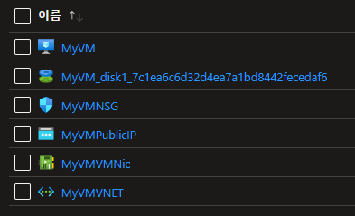

# 2주차 목록
* [Day6 교육내용](#day-6-교육내용) 
* [Day7 교육내용](#day-7-교육내용)
* [Day8 교육내용](#day-8-교육내용)
* [Day9 교육내용](#day-9-교육내용)
* [Day10 교육내용](#day-10-교육내용)

---


# Day 6 교육내용

## 주요 내용
1. Microsoft Azure Cloud Service

## 간단 평가
Microsoft Azure 클라우드 서비스 사용 방법에 대한 전반적인 실습을 진행했다.  

---

## Cloud Service
실제 클라우드는 파일 업/다운로드 말고도 다양한 기능들이 존재한다.  

클라우드 서비스는, 인프라 운영 시 크기가 커질수록 클라우드 서비스를 이용하는 것이 더 저렴하고 효율적으로 운영이 가능  

> #### 자본 지출(Capital Expenditure, CapEx)
> 물리적 인프라를 구매하여 사용, 높은 초기 비용, 가치는 시간에 따라 줄어듬(소모품)

> #### 운영 지출(Operational Expenditure, OpEx)
> 필요에 따라 서비스나 제품을 구독, 필요한 제품을 즉시 구매, 사용량에 따라 지불(pay-as-you-go)

### Cloud Service Model

공용 클라우드, 사설 클라우드, 하이브리드 클라우드  
> #### 공용(public) 클라우드
> 가장 많이 사용하는 클라우드 서비스  
> 클라우드 서비스 제공자가 소유  

> #### 사설(private) 클라우드
> 클라우드 리소스를 조직에서 소유하고 관리 및 운영  
> 특정 사용자에게만 리소스를 제공  

> #### 하이브리드(public + private) 클라우드
> 보안을 위해서 보통 private 으로 사용, 데이터량이 많아야 할 경우 하이브리드로 운영함

### 클라우드 서비스 유형
#### On-premise
Data / Application / Runtime / Middleware / OS / Visualization / Server / Storage / Network  
모두를 관리하는 유형

#### IaaS(Infrastructure-as-a-Service)  
가장 기본적인 클라우드 컴퓨팅 서비스  
네트워크, 저장소, 서버를 클라우드 제공자가 관리  
셀스 서비스 포털을 통해 프로비저닝과 관리할 수 있는 컴퓨팅 인프라 제공  
OS 부터 Data 까지 관리하는 유형이며, `가장 유용하게 사용할 수 있는` 유형

#### PaaS(Platform-as-a-Service)
사용하고자 하는 플랫폼에 맞게 자동으로 필요한 서비스가 제공됨  
Application 만 입력하면 서비스 가능  
Data 및 Application 만 관리하면 되는 유형

#### SaaS(Software-as-a-Service)
Data 만 관리하는 유형 
대부분 구독형으로 이루어져 있음 (Ex. Microsoft Ofiice Web)

## Hello Azure
서비스 Region(지역)은 약 66개, 140개 국가에서 사용 가능  
가장 가까운 Region 을 선택하여 기능을 사용할 수 있음  
또한 접근 시간 약 2ms 이하를 정의한 경계  

Region 내부에는 Data Center 가 2개 이상 존재  
Data Center 는 최소 30km 이상 떨어져있음(데이터 보존)  

가용성 : 서비스를 정상적으로 사용할 수 있는 시간(1년 대비 사용 가능 시간)  

### Azure Data Center
독립적인 전원, 냉각 장치, 네트워크를 갖춘 별도의 시설  
MS 에서 직접 구축한 센터부터 임대하여 구축된 시설  
부산에 새로운 Data Center 를 건설 중  


### Azure Resource Manager
Azure Resource Manager 를 사용하기 위해 웹 페이지에 접속하는 것은 매우 번거롭다.  
이 작업을 자동화하기 위해 `Azure PowerShell` 및 `Azure CLI` 를 사용하여 스크립트를 통해 작업할 수 있다.  
자동화를 위해 `REST Client(API)` 기능을 사용할 수 있다.  

> #### 리소스
> 가상 머신, 데이터베이스, 가상 네트워크 등 단일 리소스를 나타내는 단위

> #### 리소스 그룹
> 리소르를 묶을 수 있는 단위

> #### 리소스 공급자
> 원하는 리소스를 제공하는 서비스, 가상 머신이라는 리소스의 경우 공급자는 Microsoft.Compute

> #### 리소스 제공자
> 리소스를 제공하는 주체, Microsoft, Cisoco, Fotinet, Bitnami, NetApp 등


### Azure Cloud Shell
전용 저장소를 하나 만들어서 내부에 리눅스를 올려 사용할 수 있음  
`powershell` 및 `bash` 중 하나를 선택해서 사용 가능  

전용 명령어는 `az` 명령을 통해 사용할 수 있음  

``` bash
# 특정 그룹의 Virtual Machine 재시작 명령
$ az vm restart -g "MyResourceGroup" -n "VM_Name"

# Account List 조회 (json 타입)
$ az account list
[
  {
    "cloudName": "AzureCloud",
    "homeTenantId": "###############",
    "id": "###############",
    "isDefault": true,
    "managedByTenants": [],
    "name": "Azure for Students",
    "state": "Enabled",
    "tenantId": "###############",
    "user": {
      "cloudShellID": true,
      "name": "###############",
      "type": "user"
    }
  }
]

# Shell 로 Group 생성하기
$ az group create --location WestUS --name MyRG
{
  "id": "################",
  "location": "westus",
  "managedBy": null,
  "name": "MyRG",
  "properties": {
    "provisioningState": "Succeeded"
  },
  "tags": null,
  "type": "Microsoft.Resources/resourceGroups"
}

# 생성한 그룹에 가상 머신 생성하기
az vm create -n MyVM -g MyRG --image UbuntuLTS --generate-ssh-keys --location KoreaCentral
{
  "fqdns": "",
  "id": "##########",
  "location": "koreacentral",
  "macAddress": "##-##-##-##",
  "powerState": "VM running",
  "privateIpAddress": "######",
  "publicIpAddress": "######",
  "resourceGroup": "MyRG",
  "zones": ""
}
```

생성한 그룹 안에 가상머신이 잘 만들어진 모습



## Azure CLI Application

다운로드 :  
https://docs.microsoft.com/ko-kr/cli/azure/install-azure-cli-windows?tabs=azure-cli

설치 후 설치한 PC 환경에서 `az` 명령어 사용 가능

``` bash
# Azure 환경에 계정 연결
# 웹 브라우저에서 로그인 진행
> az login
[
  {
    "cloudName": "AzureCloud",
    "homeTenantId": "######",
    "id": "######",
    "isDefault": true,
    "managedByTenants": [],
    "name": "Azure for Students",
    "state": "Enabled",
    "tenantId": "######",
    "user": {
      "name": "######",
      "type": "user"
    }
  }
]

# 버전 정보 확인
> az version
{
  "azure-cli": "2.37.0",
  "azure-cli-core": "2.37.0",
  "azure-cli-telemetry": "1.0.6",
  "extensions": {}
}

# 연결된 계정의 Account List 확인
> az account list
[
  {
    "cloudName": "AzureCloud",
    "homeTenantId": "###############",
    "id": "###############",
    "isDefault": true,
    "managedByTenants": [],
    "name": "Azure for Students",
    "state": "Enabled",
    "tenantId": "###############",
    "user": {
      "cloudShellID": true,
      "name": "###############",
      "type": "user"
    }
  }
]
```

서버의 물리적 크기를 늘리거나 줄이는 방법  
`Scale-Up` / `Scale-Down` : 보통 DB 에 많이 사용  

서버의 개수를 늘리거나 줄이는 방법  
`Scale-Out` / `Scale-In` : 보통 Web Server 에 많이 사용  


## Azure Dashboard

만든 VM 페이지에서, `모니터링` 탭의 `메트릭` 데이터를 이용하여 대시보드 페이지에 모니터링 지표를 추가할 수 있다.  


## Resource & Resource Group 관리

계정 내부에는 구독이 존재하며, 구독은 결제를 해야 생긴다.  
계정마다 `Directory` 가 존재하며, Directory 에 구독을 연결시킬 수 있다.  

`Azure Active Directory` 서비스를 이용하여 `테넌트(Directory)` 를 하나 생성할 수 있다.  
테넌트에 다른 사람을 초대할 수 있으며, 해당 테넌트에 구독 정보를 추가하여 같이 작업할 수 있는 환경을 구축할 수 있다.  
초대한 사람 모두에게 `구독 권한` 및 `테넌트 권한` 모두 주어야 사용이 가능하다.  

---

# Day 7 교육내용

## 주요 내용
1. 

## 간단 평가
d

---

## 내부 네트워크 구성
IPv4 는 32비트 체계로 $2^{32}$(약 42억)개의 주소를 생성할 수 있다.  
단, 이미 특정한 목적으로 정해진 약 5억개의 주소가 존재하므로 실제 사용할 수 있는 주소는 약 37억개 정도이다.  

인터넷에 연결된 기기의 개수가 많아지며 IP 주소가 부족해진 상황이 되었다.  
이 문제를 해결하기 위해 `내부 네트워크(Private Network)` 구성을 통해 IP 주소의 부족 현상을 해결하고 있다.  

`Private IP` 는 `Public IP` 와는 다르게 정해진 대역이 존재한다.  
* 24Bit Block : 10.X.X.X (약 1677만개)
* 20Bit Block : 172.16.X.X ~ 172.31.X.X (약 104만개)
* 16Bit Block : 192.168.X.X (약 6만5천개)

## CIDR(Classless Inter-Domain Routing)
참고 : https://www.nakjunizm.com/2020/01/29/Cidr/  
IP 주소를 Class 없이 나타낸 표시 기법이다.  
이렇게 Subnet 을 구성하면 별도의 네트워크처럼 동작한다.  

## Subnet
실제 Azure VM 이 배치되는 네트워크 단위  
Virtual Network 에 종속  
가장 네트워크와 서브넷은 크기 조절 가능  
네트워크를 정의할 수 있는 최소 단위  
일부 Azure 서비스의 경우, 특정 Subnet을 요구  
* Gateway Subnet
* Azure Bastion Subnet
* Azure Firewall Subnet

## Azure Vitual Network

### Bastion
SSH, RDP 와 같이 외부에서 클라우드 서버를 관리할 수 있는 도구인 `Bastion` 보안 상 좋은 기능  

### DDoS Protection
DDoS 공격으로 의심되는 패킷을 자동으로 필터링해주는 기능.  
별도로 설정하지 않아도 `Basic` 기능이 작동함.  
만약 `Standard` 설정을 할 경우 공격에 대한 Report 제공

## Firewall(방화벽)
알려진 공격 방법들을 미리 정의해두어 공격에 방어하기 위한 것  


## Azure Virtual Machine
IaaS 의 대표적인 서비스  
사용하려고 하는 위치와 가장 가깝도록 생성(기준 약 2000km)

## Azure Storage Account
### Blob Storage
브라우저에 문서 또는 이미지 직접 제공  
설치 등의 분산 액세스용으로 파일 저장  
비디오 및 오디오 스트리밍  
백업, 복원, 재해복구, 보관을 위한 데이터 저장  


## Database
`Azure Database for` 수식어가 붙은 서비스는 Azure 서비스를 할 수 있도록 기능이 추가된 버전  
`Azure SQL Database` 는 양방향 동기화가 가능
> 하지만 삭제와 같은 명령도 동기화 되므로 조심해서 사용해야 함

